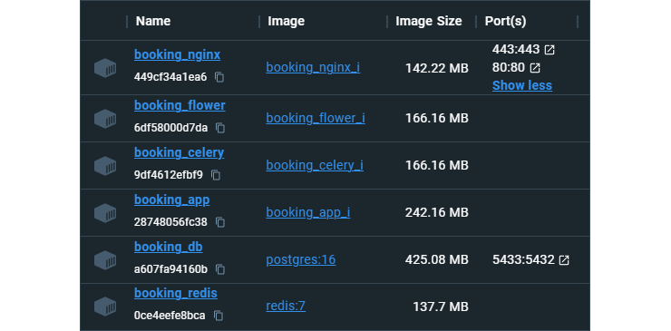

# Описание
**Booking-FastAPI - это упрощенный сервис Бронирования Отелей. Он позволяет зарегистрироваться, забронировать отель и отменить бронь.**


## Во время разработки:
-	Создал веб-API с автоматической интерактивной документацией при помощи Python, `FastAPI` и `Pydantic`;
-	Асинхронно использовал `SQLAlchemy` для быстрой обработки запросов;
-	Выбрал `PostgreSQL` в качестве СУБД;
-	Внедрил миграции для управления версиями БД при помощи `Alembic`;
-	Подключил `JWT` для обеспечения безопасности и управления сессиями пользователей;
-	Добавил админ-панель (библиотека `SQLAdmin` совместимая с SQLAlchemy и FastAPI);
-	Для написания и выполнения тестов выбрал `Pytest`;
-	Применил Docker-Compose для связи нескольких сервисов (`Nginx`, `API`, `Postgres-DB`, `Redis`, `Celery`, `Flower`);
-	Настроил `Nginx` для работы на локальном хосте;
-	Использовал инструменты для разработки: `PDM`, `Ruff`, `Black`, `isort`.

## Админ-панель (SQLAdmin)

### Пользователи


### Отели


### Бронирования


## Замена .env файлов
При запуске через `Docker Compose` файл `.env.dev` заменяется на `.env.prod` (настройка docker-compose.yml).

При тестировании файл `.env.dev` заменяется на `.env.test` (с помощью библиотеки `pytest-dotenv`).
<br />
Для этого в `pyproject.toml` добавлено:
<br />
`[tool.pytest.ini_options]`
<br />
`env_files = [".env.test",]`

Для запуска тестов из консоли необходимо явно указать `.env` файл:
```
pdm run pytest --envfile .env.test -s -v
```


## Создание секретного ключа для JWT
`AUTH_SECRET_KEY` в `.env` файлах 
```
from secrets import token_bytes
from base64 import b64encode

print(b64encode(token_bytes(32)).decode())
```


## Запуск через VS Code
1) Установить:

    [Postgres](https://www.postgresql.org/)
    <br />
    [Redis](https://redis.io/)
    (для [Windows](https://github.com/tporadowski/redis/releases/))
    <br />
    [PDM](https://pdm-project.org/latest/)

2) Склонировать репозиторий:
    ```
    git clone git@github.com:Bllagden/Booking-FastAPI.git
    cd Booking-FastAPI
    ```

3) Установить зависимости:
    ```
    pdm install
    ```

4) Создать .env файлы:
    
    `.env.dev`, `.env.test` и `.env.prod` по аналогии с:
    <br />
    `.env_example.dev`, `.env_example.test` и `.env_example.prod`
    <br />
    (`.env.prod` необязателен)

5) Настройка БД:
    
    Создать Postgres-DB и вписать настройки для подключения к ней в `.env` файлы.
    
    Находясь в корне `Booking-FastAPI` сделать миграцию:
    <br />
    ```
    pdm run alembic upgrade head
    ```

6) Настройка Celery:

    Включить двухэтапную аутентификацию и создать пароль приложения в настройках Google аккаунта для отправки электронных писем через `Celery`. Добавить пароль приложения и почту в `.env` файлы (SMTP).
    
7) Запуск:
    
    Запустить `redis-server`;
    
    Открыть `Booking-FastAPI` через VSCode и из `Run and Debug` запустить:
    <br />
    `Booking FastAPI`, `Celery Worker` и `Celery Flower` (настройки находятся в `.vscode/launch.json`).

8) Доступ:
    
    API: http://127.0.0.1:8000/docs
    <br />
    Admin: http://127.0.0.1:8000/admin
    <br />
    Flower: http://127.0.0.1:5555


## Запуск через Docker
### Запуск
1) Склонировать репозиторий:
    ```
    git clone git@github.com:Bllagden/Booking-FastAPI.git
    cd Booking-FastAPI
    ```

2) Создать .env файлы:
    
    `.env.dev`, `.env.test` и `.env.prod` по аналогии с:
    <br />
    `.env_example.dev`, `.env_example.test` и `.env_example.prod`
    <br />
    (`.env.dev` и `.env.test` необязательны)
    
3) Настройка Celery:

    Включить двухэтапную аутентификацию и создать пароль приложения в настройках Google аккаунта для отправки электронных писем через `Celery`. Добавить пароль приложения и почту в `.env` файлы (SMTP).
    
4) Запуск:
    ```
    docker-compose up
    ```

5) Доступ:
    
    API: `http://YOUR_IP/docs`
    <br />
    Admin: `http://YOUR_IP/admin`
    <br />
    Flower: `http://YOUR_IP/flower/`

### Контейнеры


## Первичное заполнение БД
Для заполнения `DEV-DB` или `PROD-DB` можно использовать данные (запросы) из файла `src/db/initial_data.sql`.

Настройки для PgAdmin, если взять их из `.env_examples`:

1) `DEV-DB` (необходимо создать для запуска приложения из VSCode)
    >Host: `localhost`
    ><br />
    >Port: `5432`
    ><br />
    >Main db: `fastapi_booking_dev`
    ><br />
    >Username: `postgres`
    ><br />
    >Password: `postgres`

2) `PROD-DB` (создается сама в докер-контейнере, есть возможность подключиться к ней извне)
    >Host: `YOUR_IP`
    ><br />
    >Port: `5433`
    ><br />
    >Main db: `booking_app`
    ><br />
    >Username: `postgres_user`
    ><br />
    >Password: `postgres_password`

3) `TEST-DB` (во время тестов заполняется сама данными из mock-файлов; создается также, как и `DEV-DB`, но с другим именем)
    >Main db: `fastapi_booking_test`


## Доработки
Проект на данный момент развернут только в локальной среде. В планах его полное развертывание, правильная работа со статическими файлами через Nginx, внедрение версионирования API и системы авторизации (сейчас у всех аутентифицированных пользователей одинаковые права).