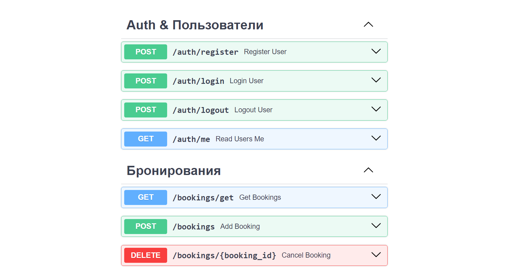

# Описание
> **Booking-FastAPI - это упрощенный сервис Бронирования Отелей. Он позволяет зарегистрироваться, забронировать отель и отменить бронь.**



## Во время разработки:
-	Создал веб-API с автоматической интерактивной документацией при помощи Python, FastAPI и Pydantic;
-	Асинхронно использовал SQLAlchemy для быстрой обработки запросов;
-	Выбрал PostgreSQL в качестве СУБД;
-	Внедрил миграции для управления версиями БД при помощи Alembic;
-	Подключил JWT для обеспечения безопасности и управления сессиями пользователей;
-	Добавил админ-панель (библиотека SQLAdmin совместимая с SQLAlchemy и FastAPI);
-	Для написания и выполнения тестов выбрал Pytest;
-	Применил Docker-Compose для связи нескольких сервисов (главное приложение, Nginx, Postgres-DB, Redis, Celery);
-	Настроил Nginx для работы на локальном хосте;
-	Использовал инструменты для разработки: PDM, Ruff, Black, isort.

## Админ-панель (SQLAdmin)

### Пользователи


### Отели


### Бронирования


## Замена .env файла для тестов
При тестировании файл `.env.dev` заменяется на `.env.test`, в котором находятся настройки тестовой БД.

Замена производится с помощью библиотеки `pytest-dotenv`.

Для этого достаточно добавить в `pyproject.toml`:
>`[tool.pytest.ini_options]`
><br />
>`env_files = [".env.test",]`

Для запуска из консоли необходими указывать `.env` файл:
>```
>pdm run pytest --envfile .env.test -s -v
>```

## Запуск через VS Code
1) Установить [Postgres](https://www.postgresql.org/)

2) Установить [Redis](https://redis.io/)
(для Windows: [link](https://github.com/tporadowski/redis/releases/))

3) Установить [PDM](https://pdm-project.org/latest/)

4) Склонировать репозиторий:
    >```
    >git clone git@github.com:Bllagden/Booking-FastAPI.git
    >cd Booking-FastAPI
    >```

5) Установить зависимости:
    >```
    >pdm install
    >```

6) Создать .env файлы:
    >`.env.dev`, `.env.test` и `.env.prod` по аналогии с:
    >
    > `.env_example.dev`,`.env_example.test` и `.env_example.prod`
    >
    > (`.env.prod` необязателен)

7) Настройка БД:
    >Создать Postgres-DB и вписать настройки для подключения к ней в `.env` файлы.
    >
    >Находясь в корне `Booking-FastAPI` сделать миграцию:
    >
    >```
    >pdm run alembic upgrade head
    >```

8) Настройка Celery:
    >Включить двухэтапную аутентификацию и создать пароль приложения в настройках Google аккаунта для отправки электронных писем через `Celery`. Добавить пароль приложения и почту в `.env` файлы (SMTP).
    
9) Запуск:
    >Запустить `redis-server`;
    >
    >Открыть `Booking-FastAPI` через VSCode и из `Run and Debug` запустить:
    >
    >`Booking FastAPI`, `Celery Worker` и `Celery Flower`.


10) Доступ:
    >API: http://127.0.0.1:8000/docs
    >
    >Admin: http://127.0.0.1:8000/admin
    >
    >Flower: http://127.0.0.1:5555

## Запуск через Docker
1) Склонировать репозиторий:
    >```
    >git clone git@github.com:Bllagden/Booking-FastAPI.git
    >cd Booking-FastAPI
    >```

2) Создать .env файлы:
    >`.env.dev`, `.env.test` и `.env.prod` по аналогии с:
    >
    > `.env_example.dev`,`.env_example.test` и `.env_example.prod`
    >
    > (`.env.dev` и `.env.test` необязательны)
    
3) Настройка Celery:
    >Включить двухэтапную аутентификацию и создать пароль приложения в настройках Google аккаунта для отправки электронных писем через `Celery`. Добавить пароль приложения и почту в `.env` файлы (SMTP).
    
4) Запуск:
    >```
    >docker-compose up
    >```


5) Доступ:
    >API: `http://YOUR_IP/docs`
    >
    >Admin: `http://YOUR_IP/admin`
    >
    >Flower: `http://YOUR_IP/flower/`


## Доработки
Проект на данный момент развернут только в локальной среде. В планах его полное развертывание, правильная работа со статическими файлами через Nginx, внедрение версионирования API и системы авторизации (сейчас у всех аутентифицированных пользователей одинаковые права).